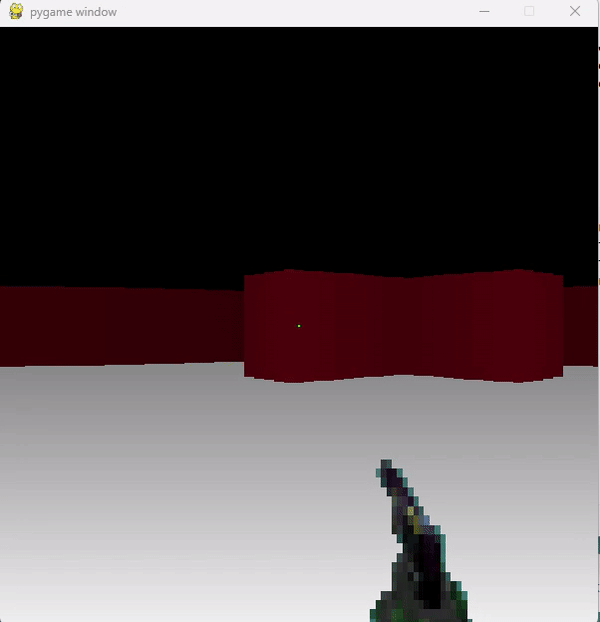

# PygameExamples
Fake3D and RayCasting with pygame

We are setting the following 2D environment:

And using it to calculate distances from the walls and create the fake 3D perception.

This is the result:

